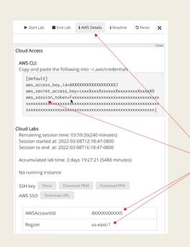

# ECR Amazon Elastic Container Registry

## What is it?

Fully managed Docker Registry integrated with AWS services.

This makes really easy while sharing images with AWS deployment environments.

All docker commands works exactly same as Docker Hub.

Image stored in Amazon S3.

## How you would use this tool serve like Docker Hub?

1. Init

Choose the visibility.

Config the repo name.


2. ECR Authentication

The following information will be needed for ECR auth.

AWS access key id.

AWS secret access key.

AWS session token.



3. config the Authentication keys

setting up the environment variables in the AWS cli

export env_variable_name actual_content

4. setting up in the aws cli

```md

aws configure 

```

This is kinda like connect you git with your github account

```md
# login a docker client to ECR use the ECR registry URL from the step 1
docker login -u AWS \
             -p $(aws ecr get-login-password --region us-east-1) \
             [the URL from step 1]
```

Then that's it you could use those commands as if you are using docker hub.


## Building github pipelines to work with ECR

1. Setting up the Encrypted Secrets

You should set those secrets from the above in

github repo => setting => action secrets

or

You could do the github cli using

```md

gh secret list

gh secret set XXXX -b 'xxxx!'

gh remove XXXX

```

2. how to use secrets the github work flows?


3. A real example


